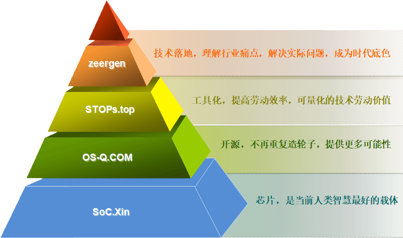

STOP
==================

**出租车送到家，公交车只到站，便捷和实惠都有光明的前途**

.. image:: https://github.com/stops-top/Docs/workflows/Docs/badge.svg
    :target: https://github.com/stops-top/Docs/actions

* 如何提高开发效率，降低工程师的学习难度和诊断难度
* 如何提高生产效率，完整收集的数据可以持续优化流程
* 如何提高使用体验，全生命周期状态管理，产品即服务
* 如何提高项目价值，智力成果工具化，链接能力和需求

.. toctree::
    :maxdepth: 1

    辅助工具 <tools/index>
    接口标准 <stopi/index>
    计算终端 <stopu/index>

