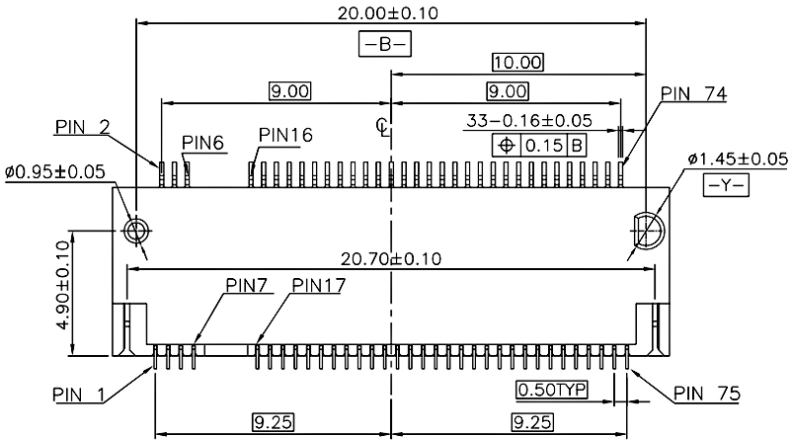
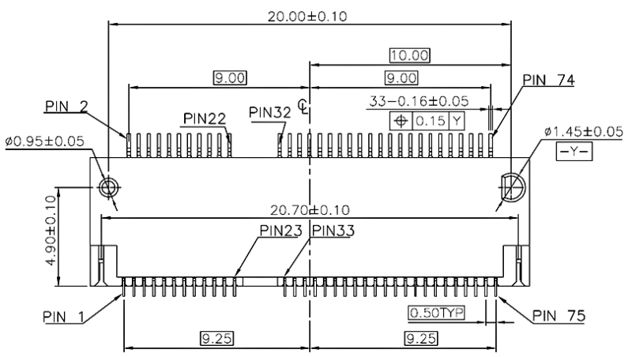
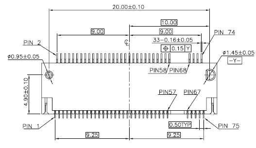

.. _ngff:

NGFF
===============
``模块化`` ``通用核心板``

.. image:: https://github.com/stops-top/NGFF/workflows/kicad/badge.svg
    :target: https://github.com/stops-top/NGFF/actions

M.2接口是一种新的主机接口方案，可以兼容多种通信协议，如sata、PCIe、USB、HSIC、UART、SMBus等。

* 第一是速度方面的优势。M.2接口有两种类型：Socket 2（B key——ngff）和Socket 3（M key——nvme），其中Socket2支持SATA、PCI-E X2接口，而如果采用PCI-E ×2接口标准，最大的读取速度可以达到700MB/s，写入也能达到550MB/s。而其中的Socket 3可支持PCI-E ×4接口，理论带宽可达4GB/s。
* 第二个是体积方面的优势。虽然，MSATA的固态硬盘体积已经足够小了，但相比M.2接口的固态硬盘，MSATA仍然没有任何优势可言。M.2标准的SSD同mSATA一样可以进行单面NAND闪存颗粒的布置，也可以进行双面布置，其中单面布置的总厚度仅有2.75mm，而双面布置的厚度也仅为3.85mm。而mSATA在体积上的劣势就明显的多，51mm×30mm的尺寸让mSATA在面积上不占优势，而4.85mm的单面布置厚度跟M.2比起来也显得厚了太多。另外，即使在大小相同的情况下，M.2也可以提供更高的存储容量。

.. image:: ./images/ngff.png
    :target: https://baike.baidu.com/item/m.2%E6%8E%A5%E5%8F%A3/18010680?fromtitle=NGFF&fromid=1576143&fr=aladdin

.. contents::
    :local:
    :depth: 1

接口规格
-----------
``A/B/E/M KEY``

.. list-table::
    :header-rows:  1

    * - :ref:`ngff`
      - :ref:`ngff_akey`
      - :ref:`ngff_bkey`
      - :ref:`ngff_ekey`
      - :ref:`ngff_mkey`
    * - :ref:`ngff_akey`
      - 67
      - 63
      - 59
      - 59
    * - :ref:`ngff_bkey`
      - 63
      - 67
      - 57
      - 59
    * - :ref:`ngff_ekey`
      - 59
      - 57
      - 67
      - 59
    * - :ref:`ngff_mkey`
      - 59
      - 59
      - 59
      - 67

.. _ngff_akey:

A KEY
~~~~~~~~~~~
``A KEY`` ``超长供应周期`` ``成熟稳定方案多``

.. _ngff_bkey:

B KEY
~~~~~~~~~~~
``B KEY`` ``极端运行环境`` ``高温高湿抗干扰``

.. image:: ./images/ngff_bkey.png

.. _ngff_ekey:

E KEY
~~~~~~~~~~~
``E KEY`` ``宽电压低功耗`` ``供电灵活效率高``

.. _ngff_mkey:

M KEY
~~~~~~~~~~~
``M KEY`` ``上新快选择多`` ``极具市场竞争力`` ``Month``

功能定义
-----------

.. contents::
    :local:
    :depth: 1

数字外设
~~~~~~~~~~~

* UART通信
* SPI 通信

电源设计
~~~~~~~~~~~

* 3.3V电源输入和输出
* RTC时钟体系
* 低功耗待机供电和控制供电

.. include:: stopi.rst
