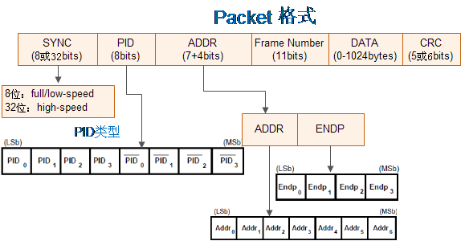

.. _usb:

USB
===============

.. contents::
    :local:
    :depth: 1

相关概念
-----------

每个系统只允许有一个HOST(主机)。允许的最大层数为6层(出去主机)；每层的电缆最大长度为5米，电缆总长度为30米；每层最大允许接5个DEVICE(设备)；

理论上一个USB主控器最多可接127个设备，这是因为协议规定每个USB设备具有一个7bit地址(取值范围为0~127，地址用于给主机识别是哪个设备，其中0地址值得注意，是给刚接入未初始化的设备使用的)。

USB1.0和USB1.1支持1.5Mb/s的低速模式和12Mb/bs的全速模式。在USB2.0以上支持480Mb/s的高速模式。

.. contents::
    :local:
    :depth: 1

物理接口
~~~~~~~~~~~

USB使用一根屏蔽的4线电缆与网络上的设备进行互联。数据传输通过一个差分双绞线进行，这两根线分别标为D+和D-，另外两根线是Vcc和Ground，其中Vcc向USB设备供电。

* 全速模式是在D+线上上拉1.5K的电阻。
* 低速模式是在D-线上上拉1.5K的电阻。

使用USB电源的设备称为总线供电设备，而使用自己外部电源的设备叫做自供电设备。

USB设备有两种供电方式

* 自供电设备：设备从外部电源获取工作电压
* 总线供电设备：设备从VBUS(5v) 取电对总线供电设备，区分低功耗和高功耗USB设备 低功耗总线供电设备：最大功耗不超过100mA 高功耗总线供电设备： 枚举时最大功耗不超过100mA，枚举完成配置结束后功耗不超过500mA 设备在枚举过程中，通过设备的配置描述符向主机报告它的供电配置（自供电/总线供电）以及它的功耗要求

由于USB是主从模式的结构，设备与设备之间、主机与主机之间不能互连，为解决这个问题，扩大USB的应用范围，出现了USB OTG。

数据传输
~~~~~~~~~~~

USB在逻辑上被分为三层：信号层、协议层、数据传输层。

一个transfer(传输)由一个或多个transaction(事务)构成，一个transaction(事务)由一个或多个packet(包)构成，一个packet(包)由一个或多个sync(域)构成。

Packet
^^^^^^^^^^^^

包（Packet）是USB系统中信息传输的基本单元，所有数据都是经过打包后在总线上传输的。
数据在 USB总线上的传输以包为单位，包只能在帧内传输。高速USB 总线的帧周期为125us，全速以及低速 USB 总线的帧周期为 1ms。
帧的起始由一个特定的包（SOF 包）表示，帧尾为 EOF。EOF不是一个包，而是一种电平状态，EOF期间不允许有数据传输。

包是USB总线上数据传输的最小单位，不能被打断或干扰，否则会引发错误。
若干个数据包组成一次事务传输，一次事务传输也不能打断，属于一次事务传输的几个包必须连续，不能跨帧完成。一次传输由一次到多次事务传输构成，可以跨帧完成。

Packet分四大类：

* 命令 (Token)
* Packet 帧首 (Start of Frame)
* Packet 数据 (Data)
* Packet 握手 (Handshake) Packet

USB包由五部分组成，即同步字段（SYNC）、包标识符字段（PID）、数据字段、循环冗余校验字段（CRC）和包结尾字段（EOP），包的基本格式如下图：

.. image:: ./images/PID.png
    :target: https://blog.csdn.net/wwt18811707971/article/details/53368879

Transaction
^^^^^^^^^^^^

在USB上数据信息的一次接收或发送的处理过程称为事务处理（Transaction）即：The delivery of service to an endpoint。一个事务由一系统packet组成，具体由哪些packet组成，它取决于具体的事务。

Transfer
^^^^^^^^^^^^

* 控制传输(control transfers):突发，非周期性，由主机发起，用于命令和状态的传输

控制传输可分为三个过程：（1）建立过程 （2）数据过程（可选） （3）状态过程

特性: 每个USB设备都必须有控制端点，支持控制传输来进行命令和状态的传输。USB主机驱动将通过控制传输与USB设备的控制端点通信，完成USB设备的枚举和配置 。
方向: 控制传输是双向的传输，必须有IN和OUT两个方向上的特定端点号的控制端点来完成两个方向上的控制传输 。

* 同步传输(isochronous transfers):周期性，持续性的传输，用于传输与时效相关的信息，并且在数据中保存时间戳的信息,如音频视频设备。用在数据量大、对实时性要求高的场合，如音频设备，视频设备等，这些设备对数据的延迟很敏感。对于音频或视频设备数据的100%正确性要求不高，少量的数据错误是可以容忍的，主要是保证数据不能停顿，所以等时传输是不保证数据100%正确的。当数据错误时，不再重传操作。因此等时传输没有应答包，数据是否正确，由数据的CRC校验来确认。

* 中断传输(interrput transfers):周期性，低频率，允许有限延迟的通信，如人机接口设备（HID）中的鼠标、键盘、轨迹球等。中断传输是一种保证查询频率的传输。中断端点在端点描述符中要报告它的查询间隔，主机会保证在小于这个时间间隔的范围内安排一次传输。

* 批量传输(bulk transfers):非周期性，大容量突发数据的通信，数据可以占用任意带宽，并容忍延迟，如USB打印机、扫描仪、大容量储存设备等。

连接过程
~~~~~~~~~~~

* step1：检测电压变化，报告主机

首先，USB设备上电后，一直监测USB设备接口电平变化HUB检测到有电压变化，将利用自己的中断端点将信息反馈给主控制器有设备连接。

* Step2：主机了解连接设备

主机在知道有设备接入后会发送一个Get_Port_Status 请求(request)给hub以了解此次状态改变的确切含义。

* Step3：Hub检测所插入的设备是高速还是低速

hub通过检测USB总线空闲(Idle)时差分线的高低电压来判断所连接设备的速度类型，当host发来Get_Port_Status请求时，hub就可以将此设备的速度类型信息回复给host。USB 2.0规范要求速度检测要先于复位（Reset）操作。

* Step4：hub复位设备

主机一旦得知新设备已连上以后，它至少等待100ms以使得插入操作的完成以及设备电源稳定工作。然后主机控制器就向hub发出一个 Set_Port_Feature请求让hub复位其管理的端口(刚才设备插上的端口)。hub通过驱动数据线到复位状态(D+和D-全为低电平 )，并持续至少10ms。当然，hub不会把这样的复位信号发送给其他已有设备连接的端口，所以其他连在该hub上的设备自然看不到复位信号，不受影响。

* Step5： Host检测所连接的全速设备是否是支持高速模式

因为根据USB 2.0协议，高速（High Speed）设备在初始时是默认全速（Full Speed ）状态运行，所以对于一个支持USB 2.0的高速hub，当它发现它的端口连接的是一个全速设备时，会进行高速检测，看看目前这个设备是否还支持高速传输，如果是，那就切到高速信号模式，否则就一直在全速状态下工作。
同样的，从设备的角度来看，如果是一个高速设备，在刚连接bub或上电时只能用全速信号模式运行（根据USB 2.0协议，高速设备必须向下兼容USB 1.1的全速模式）。随后hub会进行高速检测，之后这个设备才会切换到高速模式下工作。假如所连接的hub不支持USB 2.0，即不是高速hub，不能进行高速检测，设备将一直以全速工作。

* Step6：Hub建立设备和主机之间的信息通道

主机不停地向hub发送Get_Port_Status请求，以查询设备是否复位成功。Hub返回的报告信息中有专门的一位用来标志设备的复位状态。
当hub撤销了复位信号，设备就处于默认／空闲状态（Default state），准备接收主机发来的请求。设备和主机之间的通信通过控制传输，默认地址0，端点号0进行。此时，设备能从总线上得到的最大电流是100mA。(所有的USB设备在总线复位后其地址都为0，这样主机就可以跟那些刚刚插入的设备通过地址0通信。)

* Step7：主机发送Get_Descriptor请求获取默认管道的最大包长度

默认管道（Default Pipe）在设备一端来看就是端点0。主机此时发送的请求是默认地址0，端点0，虽然所有未分配地址的设备都是通过地址0来获取主机发来的请求，但由于枚举过程不是多个设备并行处理，而是一次枚举一个设备的方式进行，所以不会发生多个设备同时响应主机发来的请求。
设备描述符的第8字节代表设备端点0的最大包大小。虽然说设备所返回的设备描述符（Device Descriptor）长度只有18字节，但系统也不在乎，此时，描述符的长度信息对它来说是最重要的，其他的瞄一眼就过了。当完成第一次的控制传输后，也就是完成控制传输的状态阶段，系统会要求hub对设备进行再一次的复位操作（USB规范里面可没这要求）。再次复位的目的是使设备进入一个确定的状态。

* Step8：主机给设备分配一个地址

主机控制器通过Set_Address请求向设备分配一个唯一的地址。在完成这次传输之后，设备进入地址状态（Address state），之后就启用新地址继续与主机通信。这个地址对于设备来说是终生制的，设备在，地址在；设备消失（被拔出，复位，系统重启），地址被收回。同一个设备当再次被枚举后得到的地址不一定是上次那个了。

* Step9：主机获取设备的信息

主机发送 Get_Descriptor请求到新地址读取设备描述符，这次主机发送Get_Descriptor请求可算是诚心，它会认真解析设备描述符的内容。设备描述符内信息包括端点0的最大包长度，设备所支持的配置（Configuration）个数，设备类型，VID（Vendor ID，由USB-IF分配）， PID（Product ID，由厂商自己定制）等信息。

之后主机发送Get_Descriptor请求，读取配置描述符（Configuration Descriptor），字符串等，逐一了解设备更详细的信息。事实上，对于配置描述符的标准请求中，有时wLength一项会大于实际配置描述符的长度（9字节），比如255。这样的效果便是：主机发送了一个Get_Descriptor_Configuration 的请求，设备会把接口描述符，端点描述符等后续描述符一并回给主机，主机则根据描述符头部的标志判断送上来的具体是何种描述符。
接下来，主机就会获取配置描述符。配置描述符总共为9字节。主机在获取到配置描述符后，根据里面的配置集合总长度，再获取配置集合。配置集合包括配置描述符，接口描述符，端点描符等等。
如果有字符串描述符的话，还要获取字符串描述符。另外HID设备还有HID描述符等。

设备类
~~~~~~~~~~~

USB有5种标准描述符：设备描述符 、配置描述符、字符描述符、接口描述符、端点描述符。描述符之间有一定的关系，一个设备只有一个设备描述符，而一个设备描述符可以包含多个配置描述符，而一个配置描述符可以包含多个接口描述符，一个接口使用了几个端点，就有几个端点描述符。
由此我们可以看出，USB的描述符之间的关系是一层一层的，最上一层是设备描述符，下面是配置描述符，再下面是接口描述符，再下面是端点描述符。
在获取描述符时，先获取设备描述符，然后再获取配置描述符，根据配置描述符中的配置集合长度，一次将配置描述符、接口描述符、端点描述符一起一次读回。
其中可能还会有获取设备序列号，厂商字符串，产品字符串等。

堆栈协议
-----------

.. contents::
    :local:
    :depth: 1

RL-USB
~~~~~~~~~~~~

`Real-Time USB Library (Keil) <https://www.keil.com/support/man/docs/rlarm/rlarm_usb.htm>`_

.. image:: ./images/usbblockdiagr.png
    :target: https://www.keil.com/support/man/docs/rlarm/rlarm_usb.htm

主要布道推广者: `armfly <https://www.armbbs.cn/forum.php?mod=forumdisplay&fid=47>`_

tinyUSB
~~~~~~~~~~~~

用于嵌入式系统的开源跨平台 USB 主机/设备堆栈，旨在实现无动态分配的内存安全和延迟所有中断事件的线程安全，然后在非ISR任务功能中进行处理。

.. image:: ./images/tinyUSB.png
    :target: https://www.oschina.net/p/tinyusb

从机堆栈
^^^^^^^^^^^^

通过动态更改 USB 描述符支持多种设备配置。低功耗功能，例如挂起、恢复和远程唤醒。支持以下设备：

* 蓝牙主机控制器接口（BTH HCI）
* CDC
* 设备固件更新（DFU）：仅 Runtinme
* 人机界面设备（HID）：通用输入和输出设备，键盘、鼠标和游戏手柄等...
* 大容量存储类（MSC）：具有多个LUN
* MIDI
* 带有 RNDIS，CDC-ECM 的网络
* USB 测试和测量类别（USBTMC）
* 具有供应商特定类的WebUSB

主机堆栈
^^^^^^^^^^^^

主机堆栈正在重构，并且未经测试。

* 人机界面设备（HID）：键盘，鼠标，通用
* 大容量存储类（MSC）
* 集线器目前仅支持1级集线器

软件工具
-----------

.. contents::
    :local:
    :depth: 1

Zadig
~~~~~~~~~~~

Zadig是一个安装通用USB驱动程序的Windows应用程序，诸如WinUSB,libusb-win32/libusb0.sys,libusbK,可以帮助你快速的使用USB设备。

对于以下情况可能特别有用：

* 您想要使用libusb-based的应用程序访问设备
* 你想升级一个通用的USB驱动程序
* 你想使用WinUSB访问设备

源代码

.. code-block:: bash

    $ git clone git://github.com/pbatard/libwdi

Bus Hound
~~~~~~~~~~~

